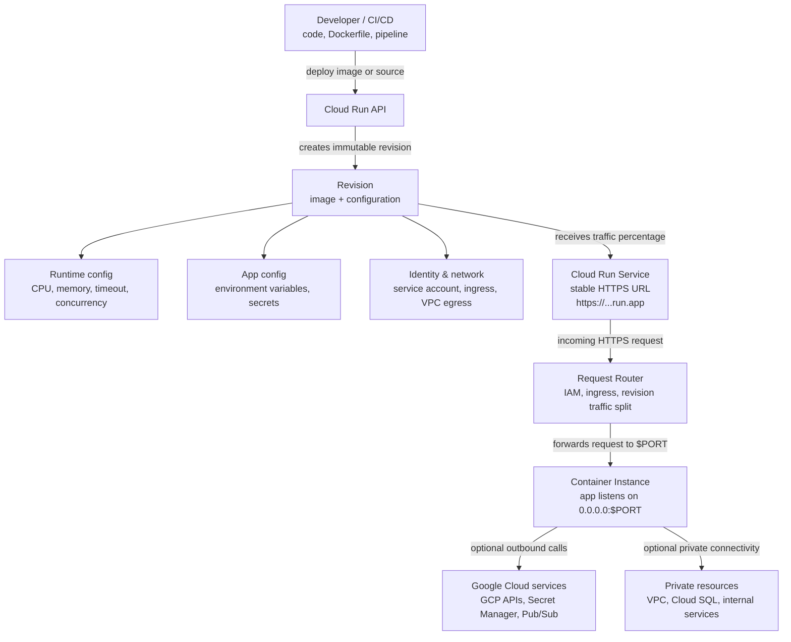

# 10 — Cloud Run Mental Model

## High-Level Flow



## Compact Exam Version

```text
Developer / CI/CD
   |
   | deploys image or source
   v
Cloud Run API
   |
   | creates
   v
Immutable Revision
   |  image + CPU/memory + env vars + secrets + service account + networking
   |
   | receives traffic percentage
   v
Cloud Run Service URL
   |  stable HTTPS endpoint: https://...run.app
   |
   | receives request
   v
Request Router
   |  checks IAM, ingress, and traffic split
   |
   | forwards to $PORT
   v
Container Instance
   |  app listens on 0.0.0.0:$PORT
   |
   | optional outbound calls
   v
GCP APIs / Secret Manager / Pub/Sub / VPC / Cloud SQL
```

## What To Remember

| Layer | Mental Model | Exam-Relevant Detail |
|---|---|---|
| Developer / CI/CD | The source of deployment. | Deploy from source or from an existing container image. |
| Cloud Run API | The control plane. | Receives the deployment request and creates a service revision. |
| Revision | Immutable snapshot of image plus config. | Every deploy creates a new revision; revisions enable rollback and traffic splitting. |
| Service URL | Stable entry point. | The URL stays stable while traffic can move between revisions. |
| Request router | Front door for requests. | Enforces IAM, ingress settings, and traffic percentages. |
| Container instance | Runtime execution unit. | The app must listen on `0.0.0.0:$PORT`. |
| Outbound dependencies | Services the container calls. | Access depends on IAM, secrets, and networking configuration. |

## Core Sentence

Cloud Run turns an image plus configuration into immutable revisions, then routes HTTPS traffic from one stable service URL to those revisions according to IAM, ingress, and traffic-splitting rules.
